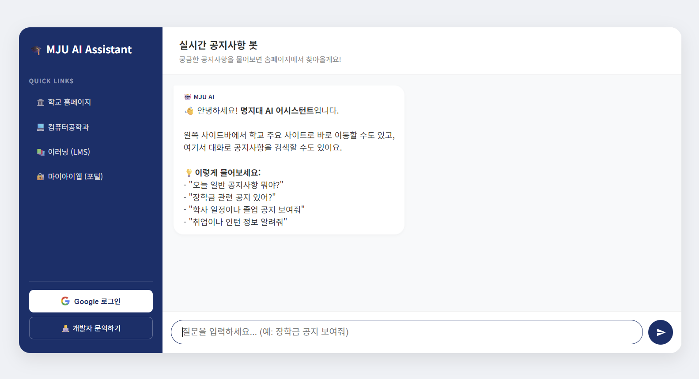

# 🎓 MJU AI Assistant: Real-Time University Notice Agent

## Overview

The **MJU AI Assistant** is a real-time, conversational chatbot that retrieves academic, scholarship, and career notices directly from the Myongji University website. It combines **Gemini 1.5 Flash**, local tool execution, and modern full-stack engineering to deliver fast, accurate, and student-friendly results.

Currently deployed and running live on **Render**: [https://mju-ai-bot.onrender.com](https://mju-ai-bot.onrender.com)

 

  
  
<em>MJU AI Assistant Dashboard & Chat Interface</em>

 

---

## 🚀 Key Features

### 1. Intelligent Notice Retrieval (Agentic Function Calling)
* Integrates **Google Gemini 1.5 Flash API** for natural language understanding.
* Dynamically maps vague user queries → precise notice board IDs.
* Executes a custom Python function (`get_mju_notices`) via Gemini’s tool-calling capability.
* Reliable intent resolution using keyword-based mapping logic.

### 2. High-Performance Backend Architecture
* **Removed MCP subprocess overhead** → eliminates cold-start latency.
* Crawler runs **directly inside Flask**, resulting in near-zero delay.
* Robust HTML parsing with `requests` + `BeautifulSoup4`.
* Refactored `crawler.py` for production-ready stability.

### 3. Full-Stack Features & Deployment
* **Live Deployment:** Hosted on **Render** with Gunicorn for production-grade performance.
* **Access here:** [https://mju-ai-bot.onrender.com](https://mju-ai-bot.onrender.com)
* Secure **Google OAuth 2.0** login (Authlib).
* Clean separation of Python, HTML5, CSS, and JS.
* Architecture designed for scalability and maintainability.

### 4. Responsive & Polished UI/UX
* Desktop dashboard optimized for clarity.
* Mobile-first layout using `dvh` for proper toolbar/safe-area handling.
* Custom modal implementation (no native `alert()` pop-ups).
* Styled using MJU’s official navy blue palette.

---

## ⚙️ Local Setup

### Prerequisites
* Python 3.10+
* Google Gemini API Key
* Google OAuth 2.0 Client ID & Secret
